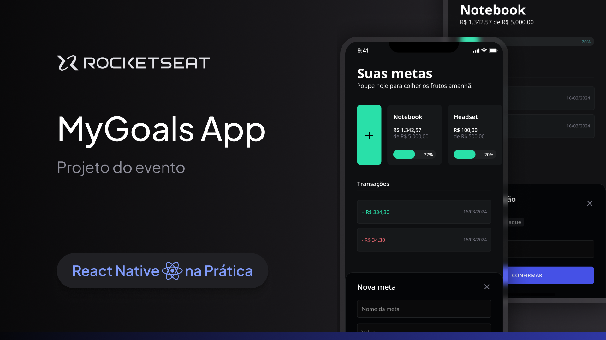

<h1 align="center">
  
  
  
</h1>

### Links

🔴 **Figma do projeto:** [MyGoals App](https://www.figma.com/community/file/1346604660147063430)

---

<h1 align="center">
  
</h1>

### Sobre o projeto

App Minhas Metas para poupar até atingir sua meta financeira para adquirir uma compra nova. Esse é um dos projetos desenvolvidos em aula do evento React Native na Prática da @Rocketseat.